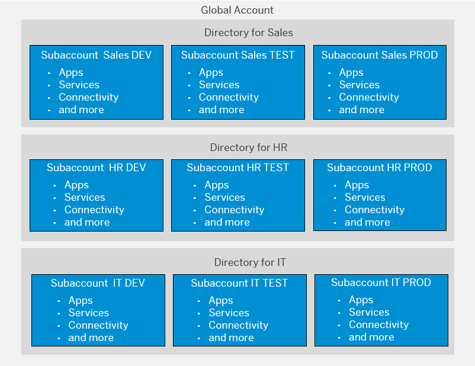
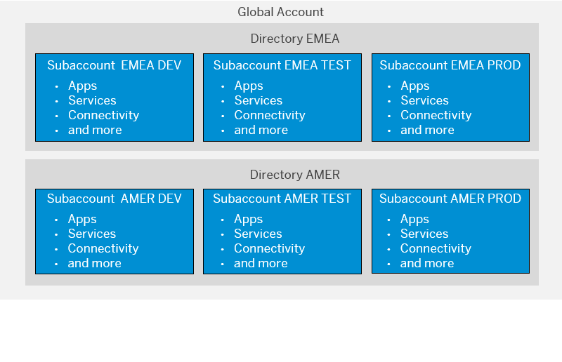
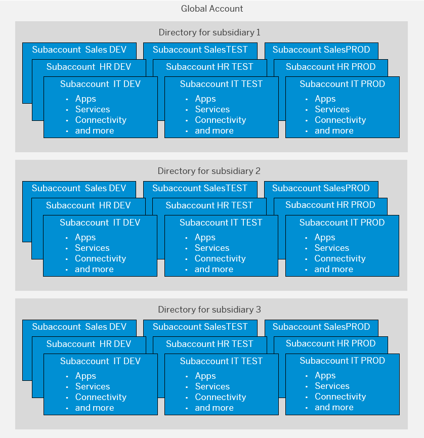

<!-- loiob5a6b58694784d0c9f4ff85f9b7336dd -->

# Account Models With Directories and Subaccounts \[Feature Set B\]

With cloud management tools feature set B, we are introducing a more flexible account structure with directories and custom properties.

> ### Note:  
> The content in this section is only relevant for cloud management tools feature set B. For more information, see [Cloud Management Tools - Feature Set Overview](https://help.sap.com/viewer/65de2977205c403bbc107264b8eccf4b/Cloud/en-US/caf4e4e23aef4666ad8f125af393dfb2.html).

<a name="loiob5a6b58694784d0c9f4ff85f9b7336dd__section_h4f_bhz_fnb"/>

## Directories

Apart from structuring your global account into several subaccounts, you can group individual subaccounts into directories to manage, operate, and analyze such groups of subaccounts together. One global account can contain n directories, which in turn, can contain n subaccounts. All examples of using directories are based on [Using Subaccounts to Create a Staged Development Environment](Using_Subaccounts_to_Create_a_Staged_Development_Environment_74eb32e.md).

Here are a few example use cases where directories help you manage your subaccounts:

-   Administrative reasons: Structure your global account according to the responsibilities within your organization. For example, give each subsidiary, department, or LOB their own directory.

-   Billing purposes: Structure your global account into directories for accounting purposes.

-   Geographical separation: Group subaccounts based on geographical locations to manage different local regulations or to improve network performance for groups that are located together.

-   Business scenario: Group subaccounts that belong to the same business scenario or according to other business needs. This gives you the option to control each business solution separately.

-   Resource limitations: Use the directory structure to control access to resources, limit usage by generating separate usage and cost reports, or define usage limitations, to give more resources to critical directories, or to enable different monitoring per directory. Or you could structure the subaccounts according to usage limits in different landscapes.

-   Technical reasons: Structure directories and subaccounts according to technical limitation and then add custom properties for virtual grouping or vice versa.

<a name="loiob5a6b58694784d0c9f4ff85f9b7336dd__section_ahv_k2z_fnb"/>

## Custom Properties

Directories and subaccounts can be tagged with **custom properties** for easy organizing and filtering. Think of custom properties as a way of virtually grouping subaccounts or directories that belong together or for which you want to create reportings. Each custom property has a name \(also referred to as a key\) and typically one or more values that are associated with the property. You can also assign a custom property to a directory or subaccount without giving a specific value. When no value is given, the custom property behaves like a tag.

Here are some examples of custom properties:

-   Landscape: Dev, Test, Prod

-   Department: HR, IT, Finance, Sales

-   Cost Center: 000001234, 000001235

-   Flagged for deletion

-   Important

> ### Tip:  
> Directories and custom properties offer two different ways of structuring subaccounts into groups. We recommend to use directories as the primary structuring mechanism and to use custom properties to build virtual groups of subaccounts or directories for which you need to create reports.
> 
> The below-mentioned account models for feature set B work for all environments. A subaccount with feature set B can either be a multi-environment subaccount where Cloud Foundry, Kyma, ABAP can be enabled, or it can be a Neo environment subaccount. For the account structure, there's no difference. Inside a subaccount, you can further structure your projects depending on the environment, for example by creating Cloud Foundry spaces.

 <a name="loiob5a6b58694784d0c9f4ff85f9b7336dd loio9a100731c3f649e7a50a2f9c2c1af5fa__loio9a100731c3f649e7a50a2f9c2c1af5fa"/>

<!-- loio9a100731c3f649e7a50a2f9c2c1af5fa -->

# Account Model 6: Create Directories Per Functional Area

This account model is based on Account Model 5 for feature set A, but it has directories as additional structural elements, i.e. a separate directory for each functional area and one for central services that are used by all.

Within each of those directories, three subaccounts \(for development, test, and production\) are created. For each directory, the functional area can use their own identity provider and manage their entitlements. Additionally, you can make use of custom properties, for example for the person responsible, cost center, or other aspects that you need for reportings later on.

<a name="loiob5a6b58694784d0c9f4ff85f9b7336dd loio9a100731c3f649e7a50a2f9c2c1af5fa__section_nxz_bxz_knb"/>

## Example of naming conventions for this account model in the Cloud Foundry environment

To ensure that there are no conflicts with special characters, we recommend to stick with lower-case letters and hyphens, and not to use spaces in names. This way, you can name a subaccount, its subdomain, and its Cloud Foundry org exactly the same. Cloud Foundry spaces should be named identically across the three tiers \(dev, test, prod\).

<table>
<tr>
<td>

Directory

</td>
<td colspan="3">

mycompany-hr

</td>
<td colspan="3">

my-company-sales

</td>
<td colspan="3">

my-company-IT

</td>
</tr>
<tr>
<td>

Subaccounts and subdomains

</td>
<td>

mycompany-hr-dev

</td>
<td>

my-company-hr-test

</td>
<td>

my-company-hr-prod

</td>
<td>

my-company-sales-dev

</td>
<td>

my-company-sales-test

</td>
<td>

my-company-sales-prod

</td>
<td>

my-company-IT-dev

</td>
<td>

my-company-IT-test

</td>
<td>

my-company-IT-prod

</td>
</tr>
<tr>
<td>

Cloud Foundry Orgs \(same name as subaccounts\)

</td>
<td>

mycompany-hr-dev

</td>
<td>

my-company-hr-test

</td>
<td>

my-company-hr-prod

</td>
<td>

my-company-sales-dev

</td>
<td>

my-company-sales-test

</td>
<td>

my-company-sales-prod

</td>
<td>

my-company-IT-dev

</td>
<td>

my-company-IT-test

</td>
<td>

my-company-IT-prod

</td>
</tr>
<tr>
<td>

Spaces

</td>
<td>

project-portal

activity-recording

</td>
<td>

project-portal

activity-recording

</td>
<td>

project-portal

activity-recording

</td>
<td>

customer-acquisition

sales-support

</td>
<td>

customer-acquisition

sales-support

</td>
<td>

customer-acquisition

sales-support

</td>
<td>

it-support

central-service

</td>
<td>

it-support

central-service

</td>
<td>

it-support

central-service

</td>
</tr>
</table>

**Related Information**  

[Account Model 5: Create a Staged Development Environment Per Functional Area](Account_Model_5_Create_a_Staged_Development_Environment_Per_Functional_Area_8f57535.md "In this scenario, the IT department creates separate Dev, Test, and Prod subaccounts for each functional area: In our example, HR, IT, and Sales each get their own subaccounts for development, test, and production.")

 <a name="loiob5a6b58694784d0c9f4ff85f9b7336dd loiodd78c89de7b04ae4a2147edd7a811187__loiodd78c89de7b04ae4a2147edd7a811187"/>

<!-- loiodd78c89de7b04ae4a2147edd7a811187 -->

# Account Model 7: Create Directories Per Location

In this account model, you create different directories for geographical areas. Additionally, for example, you can create custom properties for subaccounts that belong to the same departments in those locations.

 <a name="loiob5a6b58694784d0c9f4ff85f9b7336dd loio4f6e239aa7c0485eb4a255a5101cf1f5__loio4f6e239aa7c0485eb4a255a5101cf1f5"/>

<!-- loio4f6e239aa7c0485eb4a255a5101cf1f5 -->

# Account Model 8: Create Directories Per Subsidiary

In this account model, you create directories for each subsidiary of your company. Additionally, you can create custom properties, for example, for cost centers or owners of the individual subaccounts or directories.

 <a name="loiob5a6b58694784d0c9f4ff85f9b7336dd loio7f1c318292934e088e5cd119271f0b1e__loio7f1c318292934e088e5cd119271f0b1e"/>

<!-- loio7f1c318292934e088e5cd119271f0b1e -->

# Checklist for the Account Model Setup

Independent of the account model you choose, we recommend to go through the following steps and define guidelines for your development teams.

<table>
<tr>
<th>

Task

</th>
<th>

Step

</th>
</tr>
<tr>
<td rowspan="2">

**Fulfill prerequisites**

</td>
<td>

1. Evaluate your business and technical needs and define an account model that fits the requirements of your company.

Ensure that the account model is suitable for all areas in your company.

</td>
</tr>
<tr>
<td>

2. Define account hierarchy and guidelines and roll them out to a few pilot project managers to get their feedback.

</td>
</tr>
<tr>
<td rowspan="4">

**Define account standards and rules**

</td>
<td>

3. Create a template for new directories. See below.

</td>
</tr>
<tr>
<td>

4. Define naming conventions, for example:

-   To ensure that there are no conflicts with special characters, we recommend to stick with lower-case letters and hyphens, and not to use spaces in names.

-   Give the directory a descriptive name that starts with your company / global account name.

-   There is a 1:1 relationship between Cloud Foundry org and a subaccount, so you should give them identical names.

-   Since there is no connection between spaces in differet subaccounts, we recommend to give identical names to the dev, test, and prod versions of projects and spaces.

</td>
</tr>
<tr>
<td>

5. Define custom properties and values according to the reports you want to create.

</td>
</tr>
<tr>
<td>

6. Define rules for quota limitations.

</td>
</tr>
</table>

<a name="loiob5a6b58694784d0c9f4ff85f9b7336dd loio7f1c318292934e088e5cd119271f0b1e__section_jsr_1zf_gnb"/>

## Template for New Directories

We recommend that you create a process for the creation of new directories. Here is an example template for new directories that you can use or adapt to meet your own requirements:

<table>
<tr>
<th colspan="2">

New Directory

</th>
</tr>
<tr>
<td>

Name

</td>
<td>

Refer to your naming guidelines.

</td>
</tr>
<tr>
<td>

Owners

</td>
<td>

We recommend to appoint at least two owners.

</td>
</tr>
<tr>
<td>

Description

</td>
<td>

Describe the developer audience, which LoB or department do they belong to, what types of applications will be developed, which environments should be used, subscriptions that will be used.

</td>
</tr>
<tr>
<td>

Cost center

</td>
<td>

Define accounting requirements.

</td>
</tr>
<tr>
<td>

Enrollment

</td>
<td>

Describe how projects can enroll in your directory.

</td>
</tr>
</table>

