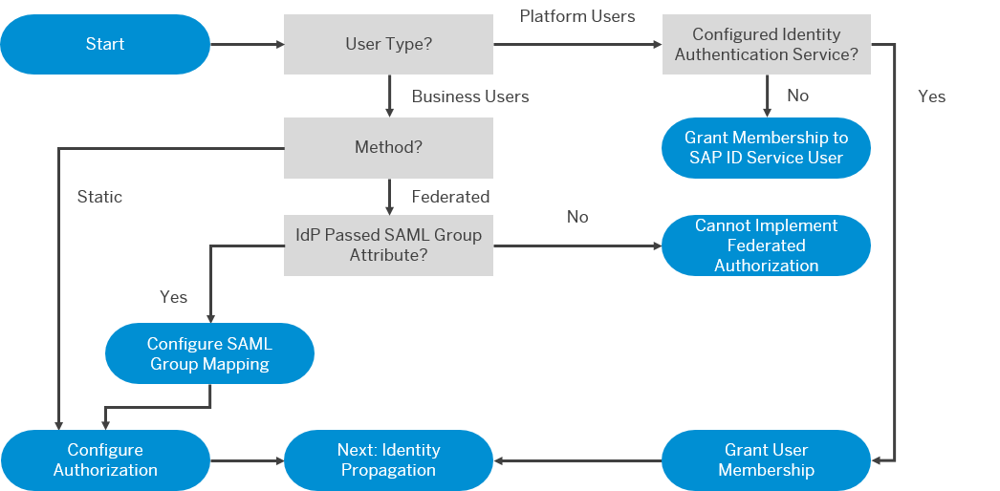

<!-- loiocb9f0ac174a248c4bc7391e5bf5a0b1a -->

# Setting Up Authorization

Users in an application require different authorizations because they work in different jobs. For more information, see **[Authorization Entities](https://help.sap.com/viewer/50fd4b19521f4bec9ee9cc6c72a90872//en-US/5d8ed75b5c72432cb0e4d846f411e0cd.html "Business users in an application require different authorizations because they work in different jobs.") :arrow_upper_right:**. SAP BTP provides various options for implementing user authorization.

-   Manual assignment by using the command line interface \(btp CLI\) or the SAP BTP cockpit. Small-sized enterprises are typical use cases for this method.

-   Assignment using a custom identity provider \(IdP\), based on the group attributes used for federation. Large firms, especially in the production phase, are candidates for this option.

    -   Technically, with a prerequisite of the passing of the group attribute in the SAML assertion, you can set up federated authorization with platform users configured with a custom IdP too.

-   Provisioning by way of external tools like the Identity Provisioning service and the SAP Cloud Identity Access Governance service. Like federation, this is an automated process and maps the roles to the organizations. This method is also typical for large firms, especially in the production phase.

    -   With provisioning, you assign individual authorizations to a business role. For example, if you have a user who needs access to different systems, the automation makes sure to assign all the authorizations that are necessary to access all the connected systems.

> ### Note:  
> Although technically handled differently, federation and provisioning are inherently similar. Doing the assignment in the IdP is simpler to implement but does not scale in the same way that provisioning can. The use of approval workflows and the information that authorizations belong together by way of role definitions are other distinct advantages in using the provisioning option. With setting up authorization in the IdP, this can only be manually achieved.

Use the decision tree below to determine how to set up authorization.

> ### Remember:  
> There are two types of users on SAP BTP: platform and business. Platform users are usually developers, administrators, or operators who deploy, administer, and troubleshoot applications and services. Business users are those who use the applications that are deployed to SAP BTP.

   
  
<a name="loiocb9f0ac174a248c4bc7391e5bf5a0b1a__fig_sgf_zrw_42b"/>Setting Up Authorization

  

In general, although you can use either identity federation or provisioning in development and testing accounts too, it makes sense to just use the manual authorization configuration.

If you have a lot of users like in widely used production accounts, identity federation or provisioning is typically used.

The federation approach is valid only for business users. Provisioning is partially available for platform users. In Feature Set B, role collections on the subaccount level can be provisioned \(for example, for Subaccount Administrator\).

In addition to subaccount authorizations \(like role collections\), you also need to assign roles for the environment, such as the Cloud Foundry [User and Member Management](https://help.sap.com/viewer/50fd4b19521f4bec9ee9cc6c72a90872//en-US/cc1c676b43904066abb2a4838cbd0c37.html "On the cloud platform, member management happens at all levels from global account to space, while user management is done for deployed applications.") :arrow_upper_right:.

**Related Information**  

[Setup SAML 2.0 for Identity Federation](https://help.sap.com/viewer/ea72206b834e4ace9cd834feed6c0e09/Dev/en-US/dc618538d97610148155d97dcd123c24.html#loiodc618538d97610148155d97dcd123c24 "The application identity provider supplies the user base for your applications. For example, you can use your corporate identity provider for your applications. This is called identity federation. SAP BTP supports Security Assertion Markup Language (SAML) 2.0 for identity federation.") :arrow_upper_right:

[Setup and Manage Roles for Authorization](https://help.sap.com/viewer/663f91a6573b49ae9fa5f0007abb4d18/Internal/en-US/db8175b9d976101484e6fa303b108acd.html "In SAP BTP, you can use Java EE roles to define access to the application resources.") :arrow_upper_right:

[Security Administration: Managing Authentication and Authorization](https://help.sap.com/viewer/50fd4b19521f4bec9ee9cc6c72a90872//en-US/1ff47b2d980e43a6b2ce294352333708.html "This section describes the tasks of administrators in the Cloud Foundry environment of SAP BTP. Administrators ensure user authentication and assign authorization information to users and user groups.") :arrow_upper_right:

[SAP Cloud Identity Services](https://help.sap.com/viewer/f48e822d6d484fa5ade7dda78b64d9f5/Cloud/en-US)

