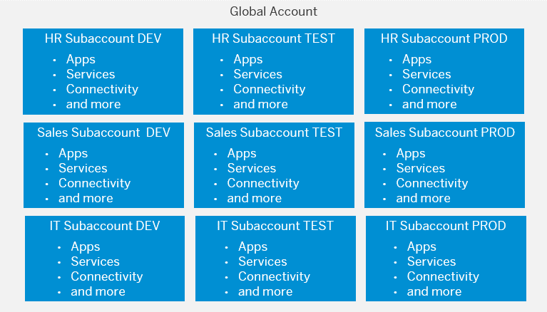

<!-- loio8f5753517acb40d58efc564471f95f52 -->

# Account Model 5: Create a Staged Development Environment Per Functional Area

In this scenario, the IT department creates separate Dev, Test, and Prod subaccounts for each functional area: In our example, HR, IT, and Sales each get their own subaccounts for development, test, and production.

With a separate account landscape per functional area, you can use multiple instances of the same SaaS subscription \(e.g. in case you need to keep data or user access separated\). For example, HR subaccounts would use an internal identity provider, whereas for public or external scenarios, an external identity provider could be used.

Using this account model, you can distribute the subaccount administration to several teams, which allows for easy scaling as the number of cloud projects grows while still having a manageable amount of maintenance and governance efforts \(unlike with account model 2\). If possible, consider assigning responsible colleagues to each group of three subaccounts, i.e. to each account landscape.

A SaaS application can only be used once within a subaccount, so if each functional area has their own subaccount \(for dev, test, and prod\), you won't encounter limitations as to using the same SaaS offering in different projects. Still, in the Cloud Foundry environment, you can separate different projects within a subaccount into different spaces.

This account model can also be combined with the structuring approach of account model 2. In addition to the structuring according to functional areas, you can create separate dev, test, and prod subaccounts for large projects that use different components or services and have a completely separated support process and operations model than your other projects.

In the Cloud Foundry environment, if you use a central Fiori Launchpad, and you want to deploy applications that use it in a different subaccount, use the [Launchpad Module](https://help.sap.com/viewer/ad4b9f0b14b0458cad9bd27bf435637d/Cloud/en-US/4dec640b19da4245be64383be24be173.html). If you want to create applications in the same subaccount as the Fiori launchpad, we recommend to deploy them to the HTML5 repository as described in [Developing HTML5 Applications](https://help.sap.com/viewer/ad4b9f0b14b0458cad9bd27bf435637d/Cloud/en-US/c1b9d6facfc942e3bca664ae06387e9b.html).

**Related Information**  

[When to Use Which Account Model](when-to-use-which-account-model-e4b4b5f.md "Determine which account model with subaccounts is the most appropriate for your needs.")

