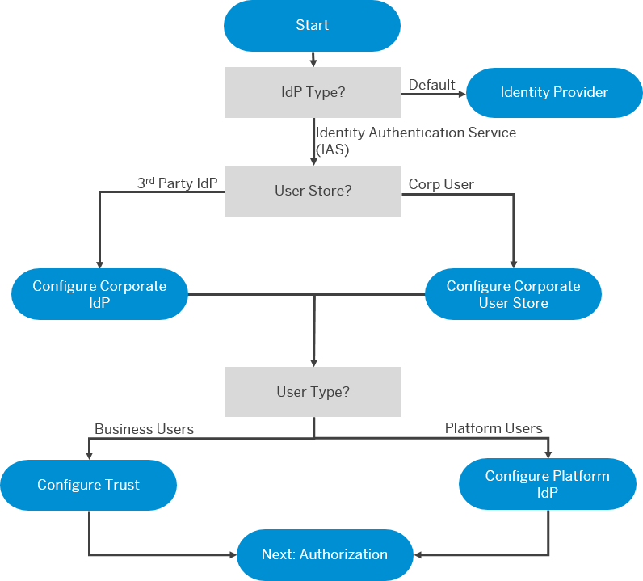

<!-- loio1dbce9caa4314103bbc9a7e3ca548280 -->

# Setting Up Authentication

SAP BTP provides various options for implementing user authentication.

Use the decision tree below to determine how to set up authentication. Once you've implemented authentication, you can start implementing user authorization.

> ### Remember:  
> There are two types of users on SAP BTP: platform and business. Platform users are usually developers, administrators, or operators who deploy, administer, and troubleshoot applications and services. Business users are those who use the applications that are deployed to SAP BTP.

   
  
**Setting Up Authentication**

  

Users can be authenticated by the Identity Authentication service or by the default identity provider.

> ### Recommendation:  
> We recommend that you use the Identity Authentication service and also connect any corporate IdPs to it.

The Identity Authentication service can authenticate users stored in the IAS user store, your own corporate user store, or by forwarding to your own corporate identity provider.

**Related Information**  

[Set up Platform Identity Provider](https://help.sap.com/viewer/ea72206b834e4ace9cd834feed6c0e09/Cloud/en-US/80edbe70b8f3478d8a59c21a91a47aa6.html "The platform identity provider is the user base for access to your SAP BTP subaccount in the Neo environment. The default user base is provided by SAP ID Service. You can switch to an Identity Authentication tenant if you want to use a custom user base.") :arrow_upper_right:

[Trust and Federation with Identity Providers](https://help.sap.com/viewer/ae8e8427ecdf407790d96dad93b5f723/Cloud/en-US/cb1bc8f1bd5c482e891063960d7acd78.html "When setting up accounts you need to assign users. While we provide you with your first users to get you started, your organization has identity providers that you want to integrate.") :arrow_upper_right:

[Identity Authentication](https://www.sap.com/community/topics/cloud-platform-identity-authentication.html)

